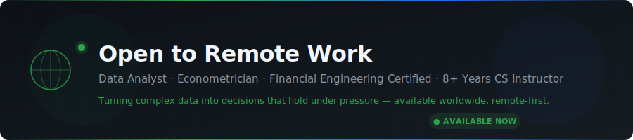
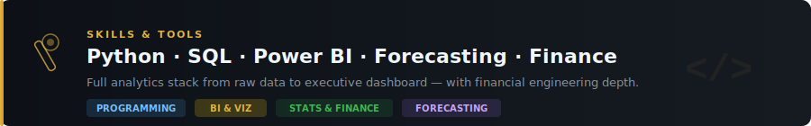
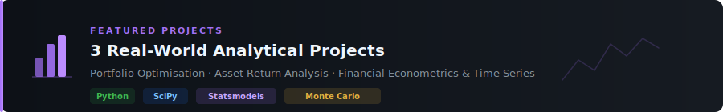
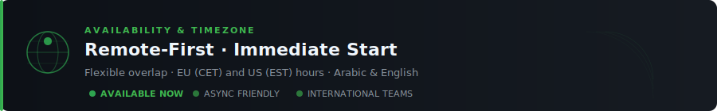

<!--
═══════════════════════════════════════════════════════════
  OPEN TO REMOTE WORK — Full README Page
  ───────────────────────────────────────────────────────
  SETUP INSTRUCTIONS (5 replacements):
  1. Replace YOUR_USERNAME   → your GitHub handle  (8 places)
  2. Replace YOUR_EMAIL      → your real email
  3. Replace YOUR_LINKEDIN   → your LinkedIn handle
  4. Replace YOUR_CITY       → e.g. Addis Ababa, Ethiopia
  5. Replace YOUR_TIMEZONE   → e.g. UTC+3 (East Africa Time)

  BANNER IMAGES:
  Upload the 6 SVG files from the /banners/ folder into a
  folder called  assets/banners/  in this repository root.
  Then the image paths below will resolve automatically.
═══════════════════════════════════════════════════════════
-->

<div align="center">

<!-- ── HERO BANNER ────────────────────────────────────── -->


<br/>


&nbsp;

&nbsp;


</div>

<br/>

---

<!-- ── WHO I AM ─────────────────────────────────────── -->


<br/>

I am a **Data Analyst and Econometrician** with 8+ years of combined industry and academic experience.
I specialise in **time series forecasting, portfolio risk modelling, financial econometrics, and business intelligence** —
and I build the kind of analytical systems that people actually use, not just admire in a slide deck.

My background sits at an unusual intersection: rigorous quantitative training on one side, and years of
university-level teaching on the other. That combination means I can build a GARCH model and explain
it to a board — and I know which one matters more in a given room.

> *"Data rarely speaks for itself. Someone has to ask it the right question, build the infrastructure
> to capture the answer, and then translate that answer into something a decision-maker can act on."*

<br/>

---

<!-- ── WHAT I AM LOOKING FOR ──────────────────────── -->


<br/>

### 🎯 Role Types

| Preference | Role |
|:---:|---|
| 🥇 **Primary** | Data Analyst · Financial Data Analyst · Econometrics Analyst |
| 🥈 **Secondary** | Quantitative Analyst · BI Analyst · Research Analyst |
| 🥉 **Open to** | Data Science roles with strong analytics & forecasting component |

<br/>

### 📋 Engagement Model

| Model | Details |
|---|---|
| ✅ **Full-time** | Preferred for the right role and organisation |
| ✅ **Contract / Fixed-term** | Open to 3–12 month engagements |
| ✅ **Freelance / Project-based** | Available for scoped analytical projects |
| ✅ **Internship / Fellowship** | Actively applying — e.g. UNDP 2026 Programme |

<br/>

### 🏢 Target Sectors

```
🏦  Finance & Investment       →  Portfolio analysis, risk modelling, financial reporting
🌐  Development Organisations  →  UNDP, World Bank, NGOs, think tanks, multilaterals
💻  FinTech & Data Platforms   →  Analytics infrastructure, forecasting products, dashboards
🎓  Research & Academia        →  Applied econometrics, quantitative research, teaching
🏛️  Public Sector & Policy     →  Data-driven policy analysis, programme monitoring & eval
📊  Consulting                 →  Client-facing analytics, data strategy, financial modelling
```

<br/>

---

<!-- ── SKILLS & TOOLS ───────────────────────────────── -->



<br/>

### 💻 Programming & Data


### 📊 Business Intelligence & Visualisation


### 📈 Statistics, Forecasting & Finance


<br/>

### 🔧 What I Can Build for You

| Domain | Capabilities |
|---|---|
| ⏱️ **Time Series & Forecasting** | ARIMA · SARIMA · GARCH · VAR · Prophet · LSTM — with uncertainty quantification |
| 📐 **Portfolio & Risk** | Efficient Frontier · Monte Carlo · VaR (historical & parametric) · Stress testing |
| 💰 **Financial Modelling** | DCF · Scenario analysis · Return distribution decomposition · Correlation breakdown |
| 📉 **Statistical Analysis** | Econometrics · Regression · Hypothesis testing · Normality testing · Bayesian |
| 🖥️ **BI & Dashboards** | Power BI dashboards · Automated ETL pipelines · Executive reporting · KPIs |
| 🎓 **Teaching & Communication** | Complex findings → clear narratives for non-technical audiences |

<br/>

---

<!-- ── FEATURED PROJECTS ────────────────────────────── -->



<br/>

> The three projects below represent the analytical foundation I bring to every engagement.
> Each is fully documented, reproducible, and available on GitHub.

<br/>

### 📈 01 · Financial Econometrics & Time Series


Built a complete time series modelling pipeline from raw financial data — stationarity testing
(ADF, KPSS), ACF/PACF diagnostics, ARIMA/SARIMA/GARCH model selection, out-of-sample validation
against AR(1) benchmarks, and forecast visualisations designed so the **uncertainty in the output
is as legible as the forecast itself**.

🔗 **[View project →](https://github.com/YOUR_USERNAME/03_Financial_Econometrics_TimeSeries)**

<br/>

### 📊 02 · Efficient Frontier Portfolio Optimisation


Implemented mean-variance portfolio optimisation **from scratch** using SciPy's minimisation
framework. 10,000-iteration Monte Carlo simulation mapping the full risk-return frontier.
Interactive visualisation — move a risk tolerance slider and watch the optimal allocation shift —
designed as both an analytical tool and a **teaching instrument**.

🔗 **[View project →](https://github.com/YOUR_USERNAME/01_Efficient_Frontier_Portfolio_Optimization)**

<br/>

### 📉 03 · Financial Asset Return Analysis


Multi-asset return distribution decomposition: normality tests (Jarque-Bera, Shapiro-Wilk),
skewness/kurtosis, Q-Q plots, historical and parametric VaR at 95% and 99% levels, and rolling
correlation analysis revealing how **diversification breaks down precisely when it is needed most**
— formatted as an investment committee report.

🔗 **[View project →](https://github.com/YOUR_USERNAME/02_Financial_Asset_Return_Analysis)**

<br/>

---

<!-- ── AVAILABILITY & TIMEZONE ──────────────────────── -->



<br/>

<div align="center">

| | |
|:---:|---|
| 📍 **Location** | YOUR_CITY |
| 🕐 **Timezone** | YOUR_TIMEZONE |
| 🌍 **Overlap** | Flexible — EU (CET) and US (EST) core hours available |
| 🗓️ **Start date** | Immediate |
| 🔄 **Work style** | Remote-first · Async-friendly · Video check-ins welcome |
| 🗣️ **Languages** | Arabic (native) · English (professional, C1/C2) |

</div>

<br/>

> I have collaborated with international teams and institutions throughout my career.
> I adapt quickly to distributed rhythms — daily standups, weekly async updates, or anything between.

<br/>

---

<!-- ── HOW TO CONTACT / HIRE ME ──────────────────────── -->


<br/>

If you are building something that needs rigorous analysis, clear data storytelling, or a financial
model that holds under stress — **I would like to hear about it.**

<br/>

<div align="center">

[](mailto:YOUR_EMAIL)
&nbsp;&nbsp;
[](https://linkedin.com/in/YOUR_LINKEDIN)
&nbsp;&nbsp;
[](https://github.com/YOUR_USERNAME)

</div>

<br/>

<div align="center">

| Channel | Response time | Best for |
|:---:|:---:|---|
| 📧 Email | Within 24 hours | Formal enquiries, project briefs, CV requests |
| 💼 LinkedIn DM | Within 24 hours | Introductions, networking, opportunities |
| 🐙 GitHub | Ongoing | Code questions, project collaboration |

</div>

<br/>

---

<!-- ── SUPPORTING DOCUMENTS ────────────────────────── -->

<div align="center">

### 📄 Supporting Documents

[](https://github.com/YOUR_USERNAME/YOUR_REPO/raw/main/CV_Data_Analyst.pdf)

> CV follows the European standard format with full descriptions of the three projects above.

</div>

<br/>

---

<!-- ── FOOTER ───────────────────────────────────────── -->

<div align="center">

*Open to the right opportunity — not just any opportunity.*

<br/>


<br/>

*Last updated: May 2026*

</div>
